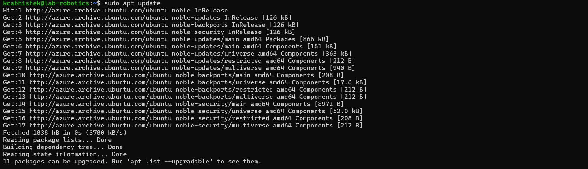
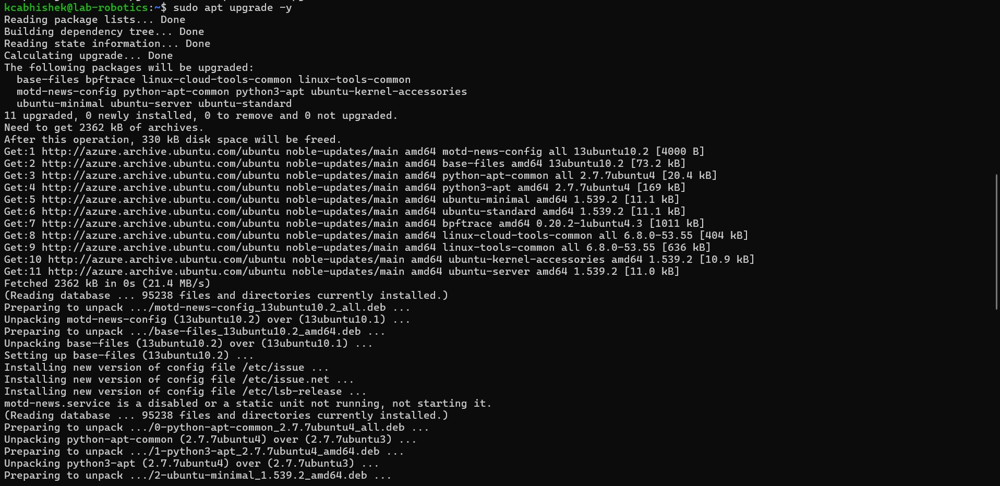
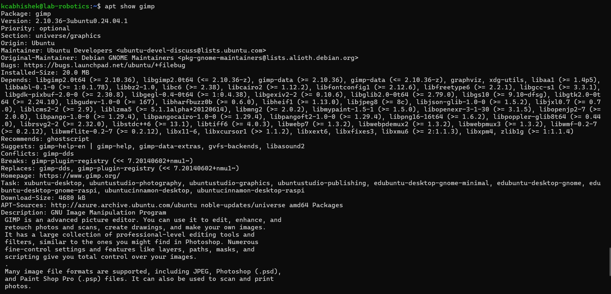
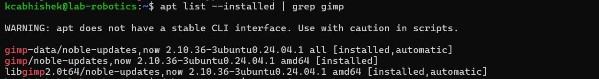
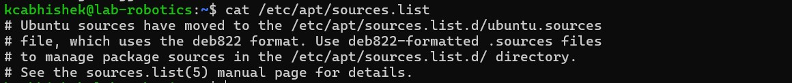
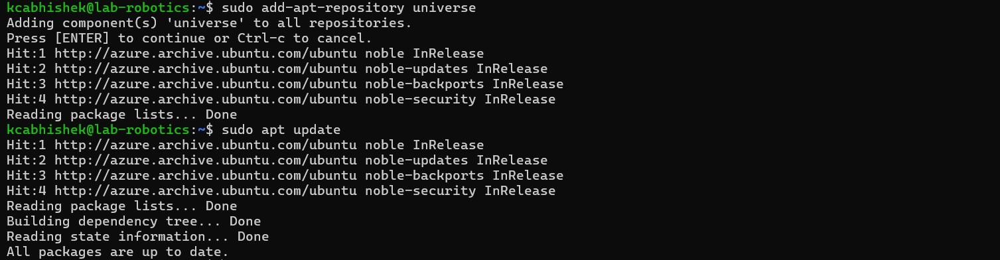
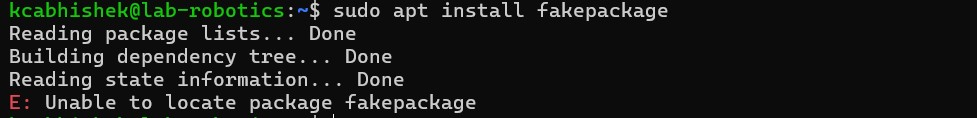

# Linux Assignment:6 Managing Packages with APT**
### 2025-01-20
- Abhishek KC, Kcabhishek23, amk1002865@student.hamk.fi

## Obejctive of this assignment
By completing this assignment, I learn:
- Learn how to install, update, remove, and search for software using APT.
- Understand how to manage repositories and resolve package dependencies.
- Gain hands-on experience in troubleshooting package installation issues.

## 1. Check your system’s APT version
### Command:
  ```bash
  apt --version
  ``` 
### Output:
 ```bash
  apt 2.7.14 (amd64)
  ``` 
## 2. Update the package list
### Command:
```bash
  sudo apt update
  ```
### Output:


### Why is this step important?
- This command updates the local package index with the latest changes from the repositories. It ensures that your system knows about the latest versions of packages and their dependencies.

## 3. Upgrade installed packages
### Command:
```bash
  sudo apt upgrade -y
  ```
### Output:


### What is the difference between update and upgrade?

| Update|Upgrade | 
| ---| --- | 
| It refreshes the list of available packages and their versions.| It installs newer versions of the packages you have. |

## 4. View pending updates (if any):
### Command:
```bash
  apt list --upgradable
  ```
### Output:


# Part 2: Installing & Managing Packages
## 5. Search for a package using APT:
### Command:
```bash
  apt search image editor
  ```
- I used a package image editor (e.g: gimp).

## 6. View package details:
### Command:
```bash
  apt show gimp
  ```
### Output:


## 7. Install the package:
### Command:
```bash
  sudo apt install zim -y
  ```
## 8. Check installed package version:
### Command:
```bash
  apt list --installed | grep gimp
  ```
### Output:


# Part 3: Removing & Cleaning Packages
## 9. Uninstall the package:
### Command:
```bash
  sudo apt remove gimp -y
  ```
### Is the package fully removed?
- No, configuration files are still retained.

## 10. Remove configuration files as well:
### Command:
```bash
  sudo apt purge gimp -y
  ```
### What is the difference between remove and purge?
| Remove|Purge | 
| ---| --- | 
| It  removes the package but keeps configuration files.| It removes the package along with its configuration files.|

## 11. Clear unnecessary package dependencies:
### Command:
  ```bash
  sudo apt purge gimp -y
  ```
### Why is this step important?
- This removes unused dependencies that were installed automatically but are no longer needed, freeing up disk space.

## 12. Clean up downloaded package files:
### Command:
```bash
  sudo apt purge gimp -y
  ```
### Why is this important?
- It removes unused dependencies that were installed automatically but are no longer needed, freeing up disk space.

# Part 4: Managing Repositories & Troubleshooting (15 min).
## 13. List all APT repositories:
### Command:
```bash
  cat /etc/apt/sources.list
  ```
### Output:


### What do you notice?
- This file contains URLs of repositories your system uses to fetch packages. It typically includes main, universe, restricted, and multiverse repositories.

## 14. Add a new repository (example: universe repository):
### Command:
```bash
  sudo add-apt-repository universe
  sudo add update
  ```
### Output:


## 15. Simulate an installation failure and troubleshoot:
### Command:
```bash
  cat /etc/apt/sources.list
  ```
### Output:


### What error message do you get?
- E: Unable to locate package fakepackage.

### How to troubleshoot:
1. Check if the package name is correct.
2. Ensure the repository containing the package is enabled.
3. Update the package list (sudo apt update).
4. Search for the package (apt search fakepackage) to confirm its existence.

# Bonus Challenge:
## 1. Hold a package:
### Command:
```bash
   sudo apt-mark hold gimp
  ```
- This prevents the package from being upgraded.

## 2. Unhold a package:
### Command:
```bash
   sudo apt-mark unhold gimp
  ```
- This allows the package to be upgraded again.

## Why would you want to hold a package?
- Holding a package is useful when you want to prevent it from being updated, such as when a new version might cause compatibility issues or break functionality.