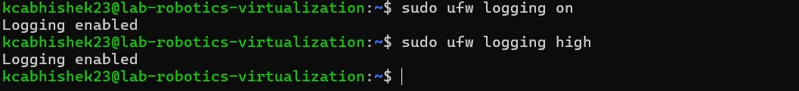

# Linux Server Firewall Configuration
### 2025-01-03
- Abhishek KC, Kcabhishek23, amk1002865@student.hamk.fi

**🚀 Introduction**
This document explains how to configure a Linux server firewall using UFW (Uncomplicated Firewall) to protect server services and prevent common network attacks. The firewall will allow necessary services such as OpenSSH, HTTP, and HTTPS while logging all blocked and allowed connections. Additionally, it will implement protections against common attacks like SYN floods and ICMP floods.

#### Step 1: Install UFW (Uncomplicated Firewall)
        sudo apt install ufw -y

#### Step 2: Enable UFW on system start
        sudo systemctl enable ufw
        sudo ufw enable


#### Step 3: Prevent Common Attacks (Default Policies)
        # Set default policies to deny incoming and allow outgoing
        sudo ufw default deny incoming
        sudo ufw default allow outgoing


#### Step 4: SSH Server Security
Why?
- SSH (Secure Shell) is used for remote server management, but open SSH ports are common attack vectors.
        # Implementation:
        # Allow SSH on port 22/tcp
        sudo ufw allow 22/tcp

        # Enable rate limiting to prevent brute-force attacks
        sudo ufw limit ssh comment 'Rate limit SSH connections'


#### Step 5: Web Server (HTTP/HTTPS) Rules
Why?
- Web servers need to accept incoming HTTP and HTTPS traffic for website access.
        # Allow HTTP (port 80)
        sudo ufw allow 80/tcp

        # Allow HTTPS (port 443)
        sudo ufw allow 443/tcp


#### Step 6: Logging Configuration
Why?
- Logging helps in monitoring traffic, debugging issues, and detecting potential attacks.
        # Enable UFW logging
        sudo ufw logging on

        # Set high-level logging
        sudo ufw logging high

        # Logs are stored at /var/log/ufw.log.


#### Step 7: Protection Against Common Attacks 
***1. SYN Flood Protection***
Why?
- A SYN flood attack exploits the TCP handshake to exhaust server resources.

- Add the following to
        sudo nano /etc/sysctl.conf

- And add these items
        net.ipv4.tcp_syncookies = 1
        net.ipv4.tcp_max_syn_backlog = 2048
        net.ipv4.tcp_synack_retries = 2
        net.ipv4.tcp_syn_retries = 5
        net.ipv4.tcp_ecn = 0
        net.ipv4.tcp_wmem = 4096 87380 8388608
        ipv4.tcp_rmem = 4096 87380 8388608

- Finally, Apply the changes
        sudo sysctl -p


***2. Block invalid packets***
Why?
- Malicious users send malformed packets to evade detection and exploit vulnerabilities.
- In a standard TCP Three-Way Handshake, every new connection begins with a SYN packet.
- If a TCP connection starts with a different flag or an unusual combination of flags – like those generated by port-scanning tools such as Nmap – these packets should be blocked.

- Add the following to
        sudo nano /etc/ufw/before.rules

- And, add these items
        -A ufw-before-input -p tcp -m tcp ! --tcp-flags FIN,SYN,RST,ACK SYN -m conntrack --ctstate NEW -j ufw-logging-deny
        -A ufw-before-input -p tcp -m tcp ! --tcp-flags FIN,SYN,RST,ACK SYN -m conntrack --ctstate NEW -j DROP

***3. Blocking Ping (ICMP) Requests***
Why?
- An ICMP flood attack, also known as a ping flood, is a type of Denial of Service (DoS) attack. It overwhelms a system by sending a huge number of ICMP packets, specifically echo requests (pings).

#### How to prevent ICMP requests
- By commenting the lines below to block ping requests (icmp protocol) by ufw

- Open the file
        sudo nano /etc/ufw/before.rules

- Comment out the following lines
```bash
  # ok icmp codes for INPUT
-A ufw-before-input -p icmp --icmp-type destination-unreachable -j ACCEPT
-A ufw-before-input -p icmp --icmp-type time-exceeded -j ACCEPT
-A ufw-before-input -p icmp --icmp-type parameter-problem -j ACCEPT
# Commment this below line
#-A ufw-before-input -p icmp --icmp-type echo-request -j ACCEPT

# ok icmp code for FORWARD
-A ufw-before-forward -p icmp --icmp-type destination-unreachable -j ACCEPT
-A ufw-before-forward -p icmp --icmp-type time-exceeded -j ACCEPT
-A ufw-before-forward -p icmp --icmp-type parameter-problem -j ACCEPT
# Comment this below line
#-A ufw-before-forward -p icmp --icmp-type echo-request -j ACCEPT
```     


🔄 Reload UFW to Apply change
        sudo ufw reload

#### Step 8: Verification and Monitoring
Why?
- To ensure rules are active and logging is working correctly.

- Check UFW status:
        sudo ufw status verbose

- Monitor logs in real time:
        sudo tail -f /var/log/ufw.log

- Test if SSH, HTTP, and HTTPS are accessible:
        nc -zv [server-ip] 22
        nc -zv [server-ip] 80
        nc -zv [server-ip] 443

