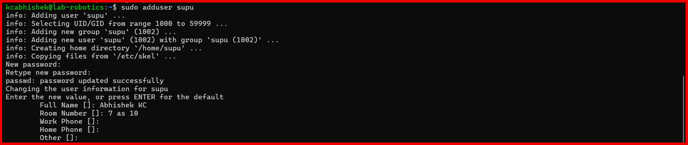
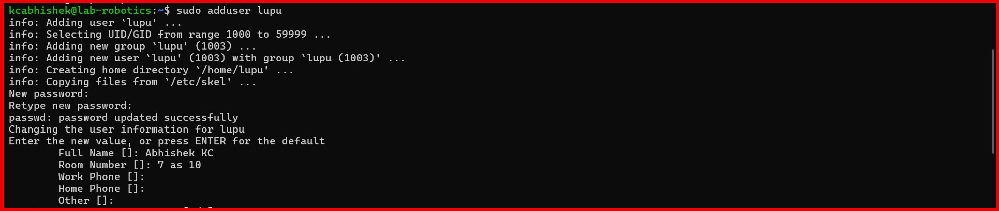
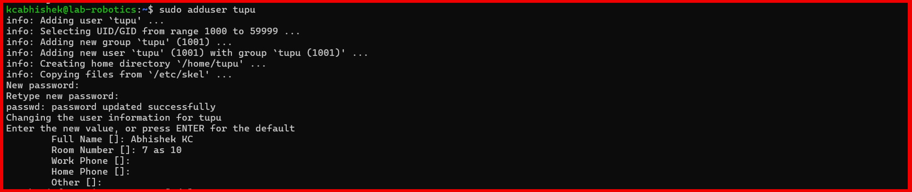

# 2025-01-30
- Abhishek KC, Kcabhishek23, amk1002865@student.hamk.fi

### First Create the Tupu user using the adduser script:
- I created users tupu and lupu using sudo adduser tupu and
sudo useradd -m -d /home/lupu -s /bin/bash -G supu lupu.Passwords were set with sudo passwd.
For sudo access, I edited the sudoers file with sudo visudo and added tupu
ALL=(ALL:ALL) ALL and lupu ALL=(ALL:ALL) ALL.
Alternatively, I added them to the sudo group using sudo usermod -aG sudo tupu and sudo usermod
-aG sudo lupu.

- Next, I set up a shared directory. I created /opt/projekti with sudo mkdir /opt/projekti,
added tupu and lupu to the projekti group using sudo usermod -aG projekti tupu and sudo usermod
-aG projekti lupu, changed ownership with sudo chown :projekti /opt/projekti, and set permissions
with sudo chmod 770 /opt/projekti. The output of ls -ld /opt/projekti confirmed the setup:
drwxrwx--- 2 root projekti 4096 Jan 30 21:45 /opt/projekti.

### Code of the Entire Project

```python  

sudo adduser tupu
sudo useradd lupu
sudo useradd hupu
sudo passwd lupu
sudo visudo
tupu ALL=(ALL:ALL) ALL  
lupu ALL=(ALL:ALL) ALL
sudo usermod -aG sudo tupu  
sudo usermod -aG sudo lupu
groups tupu  
groups lupu
sudo mkdir /opt/projekti
sudo usermod -aG projekti tupu  
sudo usermod -aG projekti lupu
sudo chown :projekti /opt/projekti
sudo chown :projekti /opt/projekti
sudo chmod 770 /opt/projekti
drwxrwx--- 2 root projekti 4096 Jan 30 21:53 /opt/projekti

```

### Showcase of the Project







