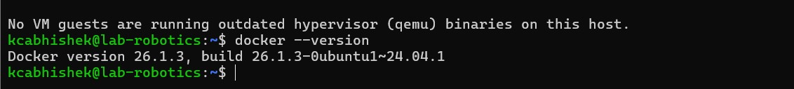
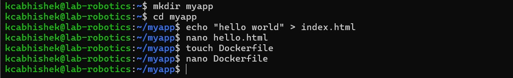
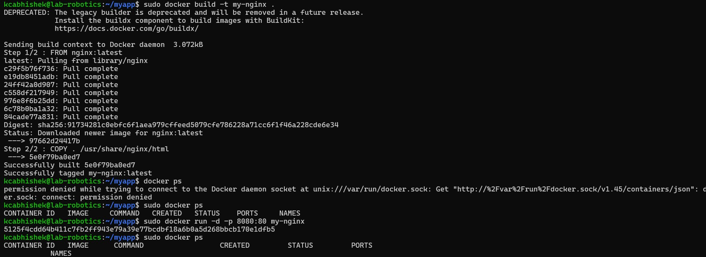
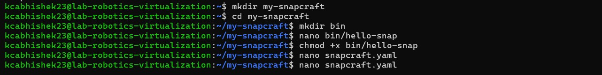
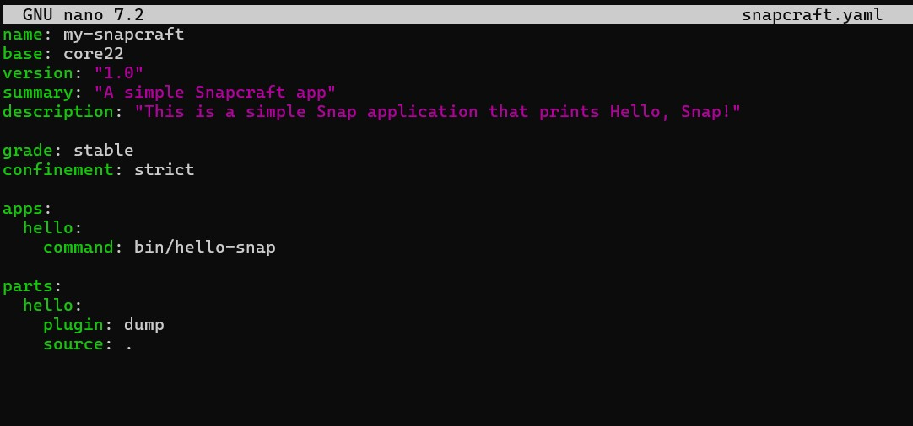
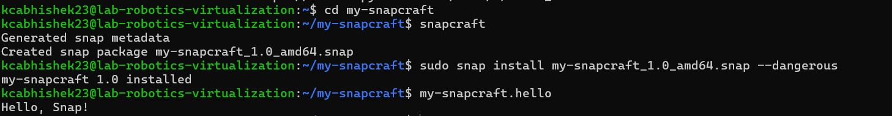

# 2025-02-19
- Abhishek KC, Kcabhishek23, amk1002865@student.hamk.fi

## Part 1: Introduction to virtualization concepts
### Virtualization:
Virtualization is the process of creating virtual versions of computing resources, such as servers, storage, networks, and even entire operating systems. It allows multiple virtual environments to run on a single physical machine, improving resource utilization and flexibility.

### Hypervisor:
A hypervisor (also called a Virtual Machine Monitor, or VMM) is software that creates and manages virtual machines (VMs). It allows multiple VMs to share the hardware of a single physical server while keeping them isolated from each other.
***There are two types of hypervisors:***
1. Bare-Metal – Runs directly on the hardware (e.g., VMware ESXi, Microsoft Hyper-V, KVM).
2. Hosted – Runs on an existing OS, acting as an application (e.g., VirtualBox, VMware Workstation).

### Virtual Machines (VMs):
A Virtual Machine (VM) is a software-based emulation of a physical computer. Each VM runs its own operating system (guest OS) and applications, independent of other VMs on the same host.
***Key Features of VMs:***
1. Includes a full OS with virtualized hardware.
2. Runs on top of a hypervisor.
3. Provides strong isolation between different VMs.

### Containers:
A container is a lightweight, portable environment that packages an application and its dependencies together. Unlike VMs, containers share the host operating system’s kernel but keep applications isolated at the process level.
***Key Features of Containers:***
1. Faster to start and stop compared to VMs.
2. Ideal for microservices and cloud-native applications.
3. Examples: Docker, Kubernetes, LXC.

### Difference Between Virtual Machines (VMs) vs. Containers:

1. Architecture:
- VMs run on a hypervisor and include a full OS, along with virtualized hardware.
- Containers share the host OS kernel and isolate applications at the process level.

2. Resource Utilization:
- VMs require more resources as each VM has its own OS.
- Containers are lightweight because they share the host OS, using fewer resources.

3. Isolation Levels:
- VMs offer strong isolation, as each runs its own OS.
- Containers provide process-level isolation but share the host OS kernel, making them less isolated than VMs.

## Part 2: Working with Multipass

### Step 1: Install Multipass
***Command***
```bash
  sudo snap install multipass
  ``` 
#### After installation, check if it's working by running
***Command***
```bash
  multipass version
  ```


### Step 2: Start Using Multipass

#### 1. Boot an Ubuntu Virtual Machine
***Command***
```bash
  multipass launch
  ```
#### 2. List All Running Instances
***Command***
```bash
  multipass list
  ```
#### 3. View Instance Information
***Command***
```bash
  multipass info <instance-name>
  ```
#### 4. Access the Virtual Machine Shell
***Command***
```bash
  multipass shell <instance-name>
  ```
#### Image of 1 to 4


#### 5. Run Commands on the Virtual Machine
***Command***
```bash
  multipass exec <instance-name> -- ls -l /home
  ```
#### 6. Stop the Instance
***Command***
```bash
  multipass stop <instance-name>
  ```
#### 7. Delete the Instance
***Command***
```bash
  multipass delete <instance-name>
  multipass purge
  ```
#### Image of 5 to 7


### Step 3: Using Cloud-init for Customization
- Cloud-init allows you to preconfigure the instance. Here's an example:

#### 1. Create a file named cloud-init.yaml:
```bash
  nano cloud-init.yaml
  ```
#### 2. And Add the following content:
```bash
  #cloud-config
  users:
  - name: myuser
    groups: sudo
    shell: /bin/bash
  packages:
  - htop
  - curl
  ```
#### 3. Launch a new instance using this command:
```bash
  multipass launch --cloud-init cloud-init.yaml
  ```


### Step 4: File Sharing:
- To share files between your host and the instance:

#### 1. Create a shared folder on your host machine:
```bash
  mkdir ~/shared-folder
  ```
#### 2. Mount the folder inside Multipass
```bash
  multipass mount ~/shared-folder <instance-name>:/mnt/shared
  ```
#### 3. Inside the instance, you can now access /mnt/shared.
```bash
  multipass shell <instance-name> ls /mnt/shared
  ```


###  Part 3: Exploring LXD
- LXD is a tool that helps you manage containers and virtual machines on your Linux system. Think of it as a "manager" for lightweight, isolated environments (containers) and full virtual machines (VMs) that run on your computer.
***Key Features of LXD:***
1. Manages both containers and virtual machines.
2. Provides a unified API for managing instances.
3. Offers advanced features like snapshots, live migration, and resource limits.
4. Built on top of LXC (Linux Containers) for better performance and security.

#### 1. Update your system:
```bash
  sudo apt update
  sudo apt upgrade -y
  ```
#### 2. Install LXD:
```bash
  sudo snap install lxd
  ```
#### 3. Verify the Installation:
```bash
  lxd --version
  ```
***Image of 1 to 3***


#### 4. Create a New Container and List it
```bash
  lxc launch ubuntu:24.04 <container-name>
  lxc list
  ```
#### 5. Start and Stop the Container
```bash
  lxc stop <container-name>
  lxc list
  ```
#### 6. Delete the container
```bash
  lxc delete <container-name>
  lxc list
  ```
***Image of 4 to 6***


###  Part 4: Part 4: How to Stick Apps with Docker

#### 1. Install Docker Engine
```bash
  sudo apt update
  sudo apt install docker-ce docker-ce-cli containerd.io -y
  ```
#### 2. Verify Installation, Check Docker version
```bash
  docker --version
  ```


#### 3. Making directory and Creating nano file in docker
```bash
  mkdir myapp
  cd myapp
  echo "hello world" > index.html
  ```


#### 4. Build Docker
```bash
  sudo docker build -t my-nginx
  sudo docker ps
  ```


###  Part 5: Snaps for Self-Contained Applications

#### 1. Install Snapd
```bash
  sudo apt install snapd
  ```
#### 2. Install Snapcraft:
```bash
  sudo snap install snapcraft --classic
  ```
#### 3. Verify Installation:
```bash
  snapcraft --version
  ```
***Image of 1 to 3***


### 🚀 Simple Snapcraft Application
- Let’s create a simple snap for a basic application. For this example, we’ll use a "Hello, Snap" Python script.

#### 1. Set Up the Project Directory
    mkdir my-snapcraft  
    cd my-snapcraft  

#### 2. Create the Application Script
    mkdir bin  
    nano bin/hello-snap  

#### 3. Paste the following content into hello-snap:
    #!/bin/bash
    echo "Hello, Snap!"

#### 4. Make the script executable:
    chmod +x bin/hello-snap  



#### 5. Define the Snapcraft Configuration
    nano snapcraft.yaml  

#### 6. Add the following configuration:
    name: my-snapcraft
    base: core22
    version: "1.0"
    summary: "A simple Snapcraft app"
    description: "This is a simple Snap application that prints Hello, Snap!"

    grade: stable
    confinement: strict

    apps:
    hello:
    command: bin/hello-snap

    parts:
    hello:
    plugin: dump
    source: .



#### 7. Build the snap package:
    snapcraft

#### 8. Install and run your snap:
    sudo snap install my-snapcraft_1.0_amd64.snap --dangerous

#### 9. Now, run your Snap:
    my-snapcraft.hello

🔥 And You should see the output:
   ```bash
  Hello, Snap!
  ```

